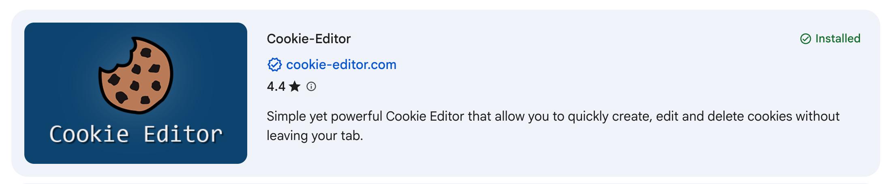
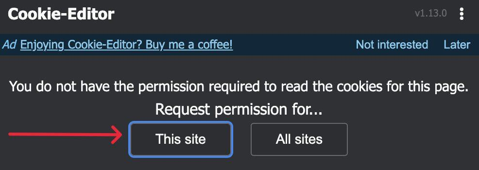
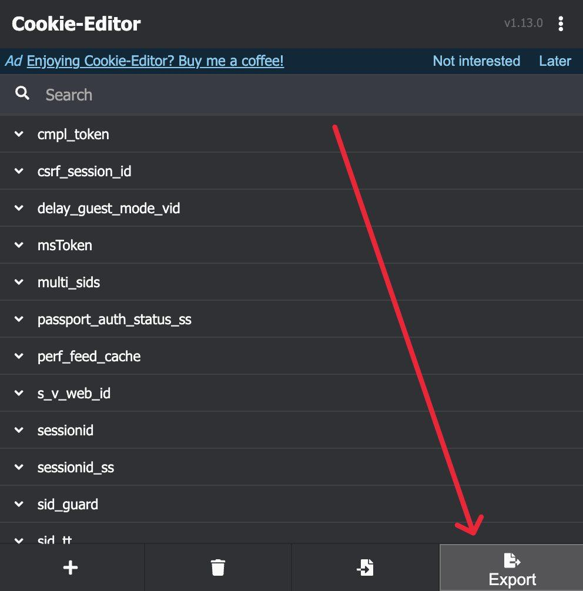

# TikTok Comment Remover

Aid against spammers and scammers on your TikTok videos. It scans the comments on one of your posts, flags bot replies, shows you the list, and deletes them only after you confirm.

## Table of Contents

- [What It Flags](#what-it-flags)
- [Requirements](#requirements)
- [Setup Guide](#setup-guide)
- [Usage](#usage)
- [How a Run Works](#how-a-run-works)
- [Good to Know](#good-to-know)

## What It Flags

- **Duplicate replies:** the same account posts the same reply under two or more different comments.
- **Excessive replies:** an account replies under more than three different comments. Every comment from that account is flagged.

Your own account is never flagged.

## Requirements

- [Python 3.11](https://www.python.org/downloads/)
- [Cookie-Editor extension](https://chromewebstore.google.com/detail/cookie-editor/hlkenndednhfkekhgcdicdfddnkalmdm?hl=en) for Chrome

## Setup Guide

1. Install the Cookie-Editor extension from the Chrome Web Store.

   

2. Open [www.tiktok.com](https://www.tiktok.com) and log in. Click the Cookie-Editor extension and, when it asks for permission, choose **This site**.

   

3. Open the extension again, click **Export** and choose **JSON**. This copies your cookies to the clipboard.

   

4. Paste the clipboard into a new text file and save it as `cookies.txt` in this folder. You can also save it anywhere else: when a script cannot find `cookies.txt`, it asks you to drag the file into the terminal and saves a copy for you.

5. Install the dependency:

   ```
   pip install -r requirements.txt
   ```

6. Check that your login works:

   ```
   python check_login.py
   ```

   You should see `login is valid` followed by your handle.

## Usage

Review what would be deleted. Nothing is deleted in this step:

```
python delete_comments.py <link to your post>
```

Delete the comments from that list:

```
python delete_comments.py <link to your post> --confirm
```

The link can be a full video link, a photo post link or a short share link.

| Option | Effect |
| --- | --- |
| `--confirm` | Really delete. Without it the script only lists. |
| `--limit 10` | Delete at most 10 comments in this run. |
| `--refresh` | Ignore the saved comments and fetch them again. |
| `--cookies <file>` | Use a cookie file other than `cookies.txt`. |

To only download the comments and replies of any public post:

```
python fetch_comments.py <link to a post>
```

## How a Run Works

1. Comments and replies are fetched and saved to `data/`.
2. Flagged comments are listed.
3. With `--confirm`, they are deleted a few seconds apart.

An interrupted run resumes where it stopped. Every deletion is logged to `logs/tiktok.jsonl`.

## Good to Know

- Deleted comments cannot be restored. Start with `--limit 3`.
- It only works on your own posts.
- `cookies.txt` is your login. Never share it.
- When the login stops working, export your cookies again.
- Automated access is against TikTok's terms of service. Use it at your own risk.
