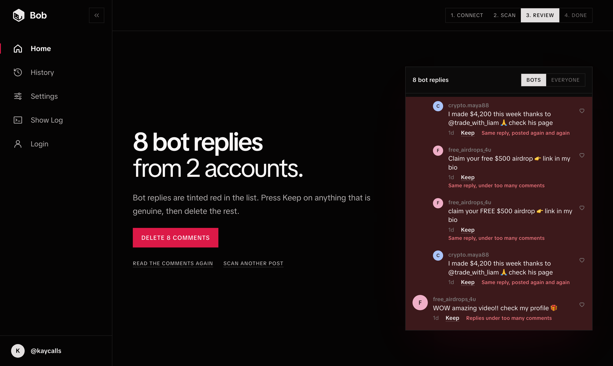

# Bob

**Delete the bot replies under your TikTok posts.** Free, open source, and it runs on your own computer.

  



## Quick Start

1. Install [Python](https://www.python.org/downloads/).
2. [Download Bob](https://github.com/usebobgg/bob/archive/refs/heads/main.zip) and unzip it.
3. Double-click `start.command` (Mac) or `start.bat` (Windows).

Bob opens in your browser and walks you through the rest.

## How It Works

| Step | What Happens |
| --- | --- |
| **Connect** | Bob shows you how to copy your TikTok login. Drop it in. |
| **Scan** | Paste the link to your post. Nothing is deleted yet. |
| **Review** | Bot replies are tinted red. Press **Keep** on anything genuine. |
| **Delete** | Confirm, and Bob removes them a few seconds apart. |

## What Counts as a Bot

| Rule | Example |
| --- | --- |
| Same reply under 2 or more comments | "I made $4,200 this week thanks to…" posted everywhere |
| Replies under more than 3 comments | One account spamming every thread |

Your own account is never flagged. Both limits can be changed in **Settings**.

## Is It Safe?

- Your login is saved in Bob's folder and only ever sent to TikTok.
- Bob runs on `127.0.0.1`, which is your own computer. Nobody else can open it.
- The start file tells you what it does before doing it, and installs nothing outside Bob's folder.
- To remove Bob, delete the folder.

## Good to Know

- Deleted comments cannot be restored.
- It only works on your own posts.
- When your login stops working, connect it again.
- Automated access is against TikTok's terms of service. Use it at your own risk.

## Command Line

```
python -m scripts.check_login
python -m scripts.fetch_comments <link to a post>
python -m scripts.delete_comments <link to your post>
python -m scripts.delete_comments <link to your post> --confirm
```

Run these from Bob's folder. Without `--confirm`, nothing is deleted.
